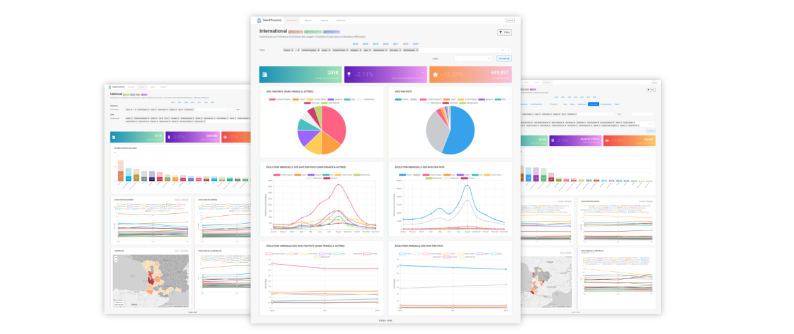

Tourism Dashboard
=================

[](https://david-dm.org/quelhasu/tourism-dashboard.svg)


![Responsiveness](https://img.shields.io/badge/responsiveness-75%25-green.svg?logo=data:image/png;base64,iVBORw0KGgoAAAANSUhEUgAAARUAAAIACAMAAACbwwhlAAABX1BMVEUAAAD///////////////////////////////////////////////////////////////////////////////////////////////////////////////////////////////////////////////////////////////////////////////////////////////////////////////////////////////////////////////////////////////////////////////////////////////////////////////////////////////////////////////////////////////////////////////////////////////////////////////////////////////////////////////////////////////////////////////8P/Ub/AAAAdHRSTlMAAQMEBQcICQoLDQ4QGBocHSAjJCUoKSssLS4yNTk8PT9ERUZLT1BRU1RYWVpdYGNlZ2tsbXFyc3d7fH1+gIeIiYqNkpyfoKKkpaart7i5v8HJyszNztDS09XW19jb3N7g4+Xn6evs7e7v8PHy8/f4+/z9/t6YSr4AAAUCSURBVHgB7dltVxNkHIDxv2ZgCqJIOU0T0UrBlNIofCApQs0c+KCUiZgGaYROdn//05lz7oFt+kLtHO/f9RF+b69oW9/o1GxxYaWc3uPKKwvF2anRvni9hibmSimbSnMTQ/HKPptP2TV/MLr26a8py4r7o2PbfymnXLvSF+375G7KuMU90a4v/01Zt3Y0NjZZTplXPhOtjSel8WhupJSUSiPRWGEVSaXVQtTrXQJSbam3rjKJo9Zk1Opfo1Frrb+mMgOj3kxUK6yzqLdeqKpMo2hsuqqySKKxxai0F0Rzeysq5zg0d66ico1Dc9cqKsscmluOiB4MrfVEDFJobTBimEJrwxFjFFobizhBobUTVKhQoULlLUSFChUqVKhQobJ8/w22/L6ojMYbbJQKlfZRoULl9tU32O13ryIqVKhQoUKFChUqVKhQoSIqVKhQoUKFChUqVKhQofLWokKFCpWlj7Pqj9dTuRtZdZsKFSpUqFChQoUKFSpUqFChQoUKFSpUqFChQoUKFSpUqFChQoUKFSpUqFChQoUKFSpUqFChQoUKFSpUqFChQoUKFSpUqFChQoUKFSpUqFChQoUKFSpUqFChQoUKFSpUqFChQoUKFSpUqFChQoUKFSpUqFChQoUKFSpUqFChQoUKFSpUqFChQoUKFSpUqFChQoUKFSpUqFChQoUKFSpUqFChQoUKFSpUqFChQoUKFSpUqFChQoUKFSpUqFChQoUKFSpUqFChQoUKFSpUqFChQoUKFSpUqFChQoUKFSpUqFChQoUKFSpUqFB5m1GhQoUKFSpUqFChQoUKFSpUqFChQoUKFSpUqFChQoUKFSpUqFChQoUKFSpUqFChQoUKFSpUqFChQoUKFSpUqFChQoUKFSpUqFChQoUKFSpUqFChQoUKFSpUqFChQoUKFSpUqFChQoUKFSpUqFChQoUKFSpUqFChQoUKFSpUqFChQoUKFSpUqFChQoUKFSpUqFChQoUKFSpUqFChQoUKFSpUqFChQoUKFSpUqFChQoUKFSpUqFChQoUKFSpUqFChQoXK6mxWPeqkIipUqFChQuXdR4UKFSpUqFChQoUKFSqiQoUKFSpUqNy5+MPp01MX71B52Z/f7Y4XDX57n0qlf77viYY+nHhEJf0+GC3t+i17leL22NC2q5mr3Noabdp6K2uVhwPRtoGHOauMRYfGMla5uSk6tOlmvipHomNHslV5vCU6tuVxriqXokuXclU5GV06mavK4ejS4VxVCtGlQq4qu6JLu3JVORBdOpCryrHo0rFcVc5Gl87mqnIjunQjV5W0Mzq2M2WrciE6diFflScD0aGBJ/mqpMvRocspY5V0Ktp2KmWtUjoUbTpUylslPT0RG/rqqUv207Zo6qMfU6KS/vpmS93kg68fJirP+3v2ix2bIzbv+Pzn5ZSo1Hv24MGz9D9XVzmeWtLxiGEKrQ1H7KbQ2u6IHgqt9UTECobmViIirnNo7npF5TyH5s5XVPZxaG5fVLoHorF78bxpEo1NV1UK6yjqrRei2gyLejPxov41GLXW+qPWJI1ak/Gy3iUc1ZZ6o15hFUil1UI0NlJKSaWRaG48JY1Ha2fKuZuUz8TGjq7ljbJ2NNq1ZzFnlMU90b6+K/miXOmLju0v5mlS3B9dOzifn8n8wXhlQxNzpXxESnMTQ/F69Y1OzRYXVsrvM0d5ZaE4OzXaF236DxCC6jilCbe/AAAAAElFTkSuQmCC)

Dashoard for the Neo4Tourism framework allowing the visualization of tourism data from TripAdvisor in order to simulate and understand tourism behaviors from aggregated graphs from Neo4J. It is therefore possible to see a trend that emerges, common behaviors through maps and graphs.

<p align="center">

</p>

<p align="center">
  <a href="https://bm.dvrc.fr/">Demo</a> | 
  <a href="https://quelhasu.github.io/tourism-dashboard/">Documentation</a> | 
  <a href="https://github.com/quelhasu/tourism-admin">Tourism Admin Dashboard</a> |
  <a href="https://github.com/quelhasu/tourism-api">Tourism API REST</a>
</p>

Installation
------------

```bash
$ git clone https://github.com/quelhasu/tourism-dashboard
```

### Development

```bash
$ cd tourism-dashboard
$ npm i
$ npm run dev
```

### Docker

Run the dockerfile or you can also include it in `docker-compose.yml` file.

```bash
$ cd tourism-dashboard
$ docker build -t tourism-dashboard .
...
$ docker run -d -p 8000:8000 tourism-dashboard
```
 
Study Scope
-----------

You can change the API address according to your case, as well as the area studied, for example here the study is about _Bordeaux Metropole_:

```json
{
  ...
  "study":"BM"
}
```

Add new routes
--------------

Go to `server.js` file and add this in `app.prepare()` function:

```js
server.get("/add/new/route/:id", (req, res) => {
  const actualPage = "/test";
  const queryParams = { id: req.params.id };
  app.render(req, res, actualPage, queryParams);
});
```

This will redirect all query with this URL to the `pages/test.js` page.
If you want to access it via the navigation bar, modify the `menu` constant `nav.js` component:

```js
const menu = [...{ href: "/add/new/route/1548", label: "New Route", icon: "" }];
```

Translation
-----------

Write all necessary translations into a file under `locales/{en,fr}` directory.  
Add withTranslation module if you want to use i18n in component or page:

```js
import { withTranslation } from "relative/path/to/i18n";
```

In the `getInitialProps()` function returns namespace(s) you want to use and export the class with the i18n module:

```js
// In the getInitialProps()
return { namespacesRequired: ["test"] };

// Export the class
export default withTranslation(["test"])(YourClass);
```

Then you can use translation available in your previous edited/created file:

```jsx
<h1> {this.props.t("test-translation")} </h1>
```

Customize colors
----------------

All the colors variables for departments, countries or cities are available in the `utils/colors.js` file.
